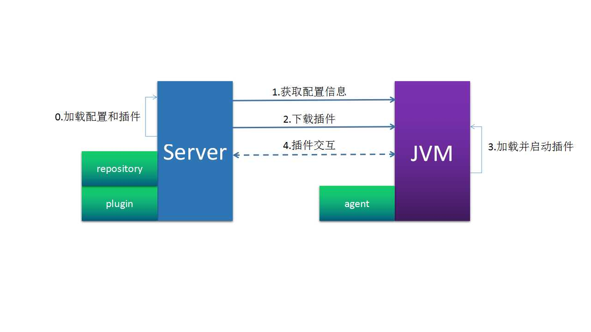

## Welcome to AWACS

[wiki]()

## 架构概述

AWACS是一款针对Java应用, 无代码侵入的开源APM. 基于插件的架构使AWACS有非常高的可定制性, 开发者可以自己开发插件.

* server：AWACS的服务端, 提供agent启动时的配置和插件下载以及接收应用在运行期上报的数据;
* plugin：监控插件, 独立打包成jar;
* repository：服务端需要使用的外部资源, 如MongoDB, MySQL等;
* JVM：被监控的目标;
* agent：被监控目标上运行的agent;

## 文档索引

- [开始]()
    * [一个简单的例子]()
    * [在容器中使用]()
    * [使用stacktrace插件]()
    * [使用mxbean插件]()
    * [AWACS集群]()

- [扩展AWACS]()
    * [一个简单的例子]()
    * [自定义存储]()
    * [自定义传输协议]()
